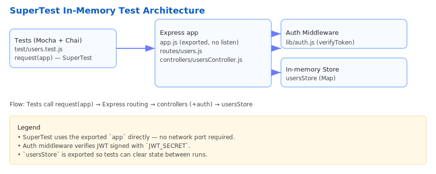

# SuperTest Express Demo

 

Small Express API with SuperTest + Mocha + Chai tests that run in-memory (tests import the app directly — no network port required).

Quick Install

```powershell
npm ci
cp .env.example .env
```

Run tests

```powershell
npm test
```

Run dev server (manual testing)

```powershell
npm run dev
# or
npm start
```
## Architecture Diagram

The diagram below shows how SuperTest interacts with the exported Express `app`, the routes/controllers, the auth middleware, and the in-memory store used in tests.




**How SuperTest is used here**

- The tests import the Express app exported from `app.js` (no `listen()` call) and pass it to SuperTest via `request(app)`.
- SuperTest invokes the Express routing and middleware stack directly in-memory — there is no network I/O or port binding during tests.
- This makes tests fast, deterministic, and free from port conflicts.

Step-by-step: how this project implements SuperTest API tests

1. Export the app (no listen): `app.js` exports `app` and the `usersStore` Map so tests can import and manipulate state.
	- See `app.js` (root handler and mounting): `app.get('/', ...)` and `app.use('/', createUsersRouter(usersStore))`.
2. Implement routes and controllers separately:
	- `routes/users.js` wires endpoints to controller factories.
	- `controllers/usersController.js` implements `register`, `login`, `list`, and `getById` handlers.
3. Minimal auth helper: `lib/auth.js` provides `signToken`, `verifyToken` and `authMiddleware` that protects endpoints by verifying `Authorization: Bearer <token>`.
4. Tests import `app` and `usersStore` and use `supertest` calls like `request(app).post('/api/register').send(...)` to exercise handlers.
	- Tests clear the `usersStore` in `beforeEach`/`afterEach` to ensure isolation.
5. For protected endpoints tests obtain a JWT via `POST /api/login` and then call protected endpoints with `.set('Authorization', `Bearer ${token}`)`.

Architecture (simple sample)

```
SuperTest (tests) --> request(app) --> Express app (app.js)
													|
													+--> routes/users.js
																 |
																 +--> controllers/usersController.js
																 |
																 +--> lib/auth.js (middleware)
													|
													+--> in-memory store (usersStore: Map)
```

Folder structure

```
/
├─ package.json
├─ .env.example
├─ README.md
├─ server.js           # starts the app (uses app.listen)
├─ app.js              # exports Express `app` and `usersStore` (no listen)
├─ routes/
|  └─ users.js         # route wiring (factory accepting store)
├─ controllers/
|  └─ usersController.js
├─ lib/
|  └─ auth.js          # jwt helpers + middleware
├─ test/
|  └─ users.test.js    # SuperTest + Mocha + Chai tests (in-memory)
└─ .github/workflows/ci.yml
```

Tests involved (what each test does)

- GET `/` — basic health check: `request(app).get('/')` calls the root handler in `app.js`.
- POST `/api/register` — creates a user in `usersStore`; test calls `request(app).post('/api/register').send(...)` and asserts `201` + returned `id`.
- POST `/api/login` — returns JWT for existing users; test gets token via `request(app).post('/api/login')`.
- GET `/api/users` (protected) — test checks missing token returns `401 { error: 'no_token' }`, and with token returns `200 { data: [...] }`.
- GET `/api/users/:id` — test for `404` when id not found and `200` for valid id using a manually signed token.

SuperTest (in-memory) vs Normal API tests (network)

- SuperTest in-memory:
  - Runs against the `app` instance directly: `request(app)`.
  - No TCP/HTTP listening required — faster and less flaky.
  - Easier to run in CI without port allocation.
  - Tests exercise real middleware and routing stack, including auth middleware.

- Normal API tests (network/black-box):
  - Run against a running server (e.g., `http://localhost:3000`).
  - Useful for end-to-end testing with real network behavior, load balancers, or reverse proxies.
  - Slower, can be flaky due to networking and port conflicts, and requires start/stop orchestration.

When to use which:

- Use SuperTest in-memory tests for fast unit/integration tests that exercise routing and middleware.
- Use full-network tests for end-to-end scenarios where the network, TLS, or external infra matters.

Notes & tips

- Keep `app.js` free of `app.listen()` so tests can import it safely.
- Export any in-memory stores you need to reset between tests (here `usersStore` is exported).
- Use deterministic secrets in test env (we set `JWT_SECRET` in tests) so tokens are verifiable.
- Use `beforeEach`/`afterEach` to isolate state between tests.

Commands

```powershell
npm ci
cp .env.example .env
npm test
```

If you want, I can add a diagram (SVG/PNG) for architecture or expand the README with badges and a CI status badge. Let me know which embellishments you'd like.
